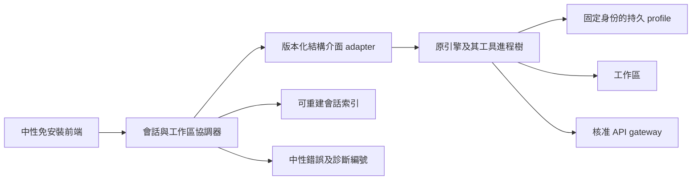

# 統一執行邊界與免安裝封裝設計

日期：2026-09-25。狀態：A 方案實施中；核心已部分落地，完整驗收未完成。
2026-09-26 範圍更新：本次放行目標限 **Windows 11 x64**；其他作業系統與架構不列為放行門檻。GitHub 託管的 `windows-latest` 若實際為 Windows Server，只能作回歸證據，不能替代 Windows 11 x64 驗收。
實作與缺口見 [證據台帳](2026-09-25-unified-sandbox-evidence.md)，本文要求不因部分測試通過而縮減。
讀者：開發及 IT 架構審查。本文不是使用者交付文件；來源連結及內部名稱需保留以便核實。

## 1. 決策摘要

已確認端點完全不允許安裝驅動或服務。因此撤回 Sandboxie Plus 作為本案預設方案，也不將啟用 Hyper-V、WSL 或 Windows Sandbox 當成免安裝的前置條件。

使用者最後明確補充：「只是免安裝運行的程序不能有。用戶資料不用限制。也就是你打包出來的程序不能有。」因此選定 A 作為主方案：中性免安裝程式包＋獨立使用者資料。B/C 保留作取捨記錄，不列入實施範圍。

交付命名規則覆蓋我們控制的檔名、目錄、公開設定名稱及使用者文件。使用者選擇的父目錄、既有文件及引擎建立的使用者資料不改名。保留官方二進位內容，不宣稱二進位內部字串、簽章發行者或實際 runtime 環境已移除原名；如果驗收要掃描這些內容，必須重新評估，不能以封裝或資料目錄作為已滿足的證明。

統一原則：將交付程式、使用者資料與呈現分開；保留原引擎的內部語義。停止擴大逐個 Win32 API、字串及功能的改寫。本案選擇統一相容性封裝，不將其宣稱為能控制所有系統訪問的安全沙箱。

| 最終限制 | 可行方向 | 尚需確認或驗證 |
|---|---|---|
| 只限制一般使用者可見的名稱，內部允許原名 | 免安裝中性前端＋官方結構化介面；原引擎本機執行 | 這是相容性封裝，不是完整安全沙箱 |
| 本機檔案命名及進程環境都受限，允許核准遠端執行 | 免安裝前端＋內網遠端隔離工作區 | 伺服器部署、資料傳輸及執行權限 |
| 宿主路徑和環境受限，允許虛擬機內保留原名 | 純使用者態全系統模擬作為技術驗證候選 | 模擬器允許執行、映像內容允許、效能及工具相容性 |
| 本機及任何內部環境均禁止原名，且必須使用原引擎 | 目前不能承諾滿足 | 需要上游支援的可配置版本，或放寬條件／替換引擎 |

這不是靠再加一層 DLL 就能消除的矛盾。SDK 也會使用原引擎，不等於消除了內部名稱。[官方 SDK 概述](https://code.claude.com/docs/en/agent-sdk/overview)

## 2. 原始需求與問題追溯

| ID | 需求 | 驗收要點 |
|---|---|---|
| R01 | Windows 端點免安裝 | 普通帳戶啟動，不新增驅動、服務、系統功能；離線完成解包 |
| R02 | 統一中性產品名稱 | 入口、捷徑、提示、交付檔名及使用者手冊符合名稱規則 |
| R03 | 交付路徑、檔名及公開環境變量符合規則 | 掃描交付包、公開設定與解包後程式；使用者資料豁免，runtime 內部環境另列限制 |
| R04 | 原有工具穩定 | Bash、Grep、Glob、Read、Write、Edit、技能、子代理、MCP 有明確相容矩陣 |
| R05 | 歷史持續可用 | 重啟、搬移、更新、回滾後可列出並續接；不是只顯示摘要 |
| R06 | 只用核准 API 通道 | 保留中性設定入口；憑證及網路限制不依賴 DNS hook |
| R07 | 統一覆蓋子進程 | 同一環境內執行引擎與工具鏈；沒有未審核的宿主執行旁路 |
| R08 | 易於更新、診斷和回退 | 原版負載校驗、版本組合固定、狀態可備份、故障不靜默降級 |

既有修復與新架構必須分開評估：

- Bash 的 EEXIST：部分路徑改写使不同檔案 API 看到不同名稱空間；既有修復已移除檔案路徑 hooks。
- Grep／Glob 的找不到執行檔：既有 Windows 測試證明 `.bin` 與可自啟動 `.exe` 的差異；修復採用 `.exe`。
- 歷史問題：舊資料位置與新位置不同、列舉與寫入視圖不一致均需處理。既有程式已做缺失檔案的單次複製恢复，不能因此宣稱所有 `/resume` 情況都已解決。
- 截圖的空白 `No such tool available:`、無效 JSON：不能由路徑錯誤直接推導。須檢查模型回覆、API 代理及事件組裝；沙箱不會自動修好工具協定。

既有驗證包含兩個回報版本的官方 `--resume` 接收歷史上下文，未覆蓋原互動式 `/resume` 選單，也未驗證本文候選架構。[Windows 回歸記錄](https://github.com/BobbyNie/claude-code-exe/actions/runs/36104171007)

## 3. 方案取捨

| 技術 | 免新增端點驅動／服務 | 是否統一隔離原引擎 | 名稱限制 | 結論 |
|---|---|---|---|---|
| 自製 API hooks | 可以 | 無法由有限 hooks 保證全部訪問 | 易漏掉 NT API、子進程、快取及日誌 | 不再擴展 |
| 本機中性前端／SDK | 可以，需離線打包依賴 | 不提供完整 OS 邊界 | 內部原名仍在 | 僅在內部名稱允許時適用 |
| Sandboxie Plus | 不符合本案安裝限制 | 有成熟應用隔離機制 | 沙箱中仍保留原檔名 | 本案排除 |
| MSIX／AppContainer | 視部署條件 | 不能假設任意 CLI 工具直接相容 | 不做全面名稱轉換 | 不作本案通用解答 |
| 既有虛擬化平台 | 依賴既有系統功能／管理 | 可隔離完整 guest | guest 內仍有原名 | 未獲允許，不預設存在 |
| QEMU 全系統 TCG 模擬 | 技術候選，端點需准許可執行檔 | 完整 guest 邊界，仍有模擬器攻擊面 | 宿主只見映像檔，映像內仍有原名 | 只做條件式 POC |
| 核准內網遠端環境 | 端點可免安裝 | 由伺服器工作區隔離 | 端點可不落原引擎路徑／環境 | 允許遠端時優先評估 |

QEMU 官方列出 Windows 的 TCG 支援；這是純軟體模擬候選的依據，不代表已證明本專案可免安裝高效運行。WHPX 等加速器與 TCG 必須區分。[QEMU 系統模擬](https://www.qemu.org/docs/master/system/introduction.html)

Sandboxie 的重定向儲存會保留原路徑組件，不能把它視為名稱替換器。[Sandbox hierarchy](https://sandboxie-plus.github.io/sandboxie-docs/Content/SandboxHierarchy/)

## 4. 共用架構

圖中的 adapter、引擎、profile 及工作區必須一起放入選定執行邊界。遠端方案把它們放在核准伺服器；模擬方案放在 guest；內部名稱允許的簡化方案才放在宿主。

### 4.1 中性前端

建議維持 `ccode.exe` 入口，先提供中性 CLI/TUI，不必為改名另建大型桌面 GUI。前端使用結構化事件顯示訊息、工具執行、權限問題和會話列表。不透傳原互動終端的啟動畫面、原始 stderr 或內部絕對路徑。

前端支援「繼續上次會話」和「選擇歷史會話」，可保留 `/resume` 作為我們自己的入口；它映射到明確 session ID，而不是轉發任意斜線命令。列出每項支援及未支援的命令，不宣稱官方 TUI 全部功能等價。

產品名稱中性化與使用者原始程式碼、文件、模型自由文字不同。不得為了消除字樣而修改使用者檔案、工具 JSON、搜尋條件或會話原文。如果連任意內容顯示都受限，另定顯示策略及例外；它不屬於檔名改寫。

### 4.2 結構介面 adapter

使用官方 SDK 或已文件化 CLI 結構介面；固定 adapter、SDK、引擎、工具鏈版本組合。官方 SDK 有工具、會話及權限等能力，但每個需求仍須對指定版本做 POC，尤其互動批准、取消、技能及 MCP。[官方 SDK 能力](https://code.claude.com/docs/en/agent-sdk/overview)

adapter 只負責建立／恢復會話、提交輸入、接收事件、批准／拒絕、取消及列出能力。工具名稱、工具 ID、參數及結果不做品牌字串替換。不要自行重寫未公開協定。

對串流工具參數先收齊該區塊，再解析與 schema 驗證；不能把中間尚未完整的 JSON 判作最終錯誤。最終名稱為空、JSON 無效、工具未註冊、事件 ID 衝突各有獨立錯誤碼。禁止猜測缺失工具或自動重放有副作用的调用。

### 4.3 路徑、環境與工作區

在執行邊界內保留原引擎預期的名稱。中性 `A_*`、`C_*` 設定可作為既有入口兼容，在 adapter 啟動引擎時依版本化 mapping manifest 一次轉成引擎設定；不攔截每個 getenv。這只有在該邊界內允許原環境變量時才成立。

工作區具穩定 UUID，安裝位置和工作區身份分離。遠端／guest 的工作區路徑保持穩定，避免變更磁碟位置導致歷史被歸類至另一個項目。

同機簡化方案可以在使用者選定工作目錄直接編輯，但這不是安全隔離。遠端／模擬方案使用明確檔案同步：開始時記錄基線雜湊、執行後預覽差異、發布前再比對宿主版本；衝突停止，不覆蓋使用者新改動。禁止把整個主目錄作為共享磁碟。

Windows 11 x64 的本機 A 方案以啟動目錄作預設工作區，並提供 `--workspace PATH` 從可啟動的短目錄顯式選擇工作區；相對 `--data-dir` 仍以啟動目錄為基準，不因工作區選擇改變。選定路徑必須是存在的本機目錄，前端在建立 profile、啟動引擎或送出 API 請求前完成 preflight。

本次不宣稱支援超過 Win32 子進程 current-directory 邊界的工作區。`CreateProcessW` 的 `lpCurrentDirectory` 仍受 `MAX_PATH` 限制，`longPathAware` 不能把該參數變成任意長；前端因此把本機工作區字串上限固定為 258 個字元，259 以上回報 `E_WORKSPACE_PATH_TOO_LONG`。UNC（含 `\\?\UNC\`）明確不支援並回報 `E_WORKSPACE_UNSUPPORTED`；`\\?\`、`\\.\` device／extended namespace 回報 `E_WORKSPACE_PATH`。拒絕必須 exit 64、stdout 空、不得建立資料區或接觸模型 API。這是相容性邊界，不是 OS 安全沙箱。

同步處理二進位檔、刪除、重命名、大小寫、換行、符號連結與 junction。路徑以規範化後的相對路徑加工作區 ID 傳遞，拒絕跳出根目錄。Git、建置和搜尋必須針對同一份工作區；不讓本機 Git 和遠端工具同時操作同一個索引。

## 5. 候選部署設計

### A. 內部名稱允許：簡化本機封裝

分離版本化唯讀 runtime 與長期 profile；原引擎不再依赖自製環境／DNS hook。單一前端建立受控子進程樹，啟動失敗清楚報錯，關閉時等待或取消工具。使用系統既有權限執行，不要求管理員。

建議程式目錄為 `ccode.exe`、`runtime/<version>/engine.exe`、`assets/`、`docs/`；使用者資料為使用者選定的 `data/profile/`、`data/workspaces/`、`data/logs/`。程式目錄不寫 session 或 temp；profile 內原引擎必要的資料命名不改寫。可提供攜帶資料模式，但必須把程式包與執行後使用者資料區分，重新打包交付時排除資料。

公開環境只記錄中性名稱，不修改使用者全域環境。引擎子進程必要的原變量只在啟動時建立，保留正常繼承語義；這不是「整棵進程樹環境完全沒有原名」的承諾。若後者仍是硬性條件，A 方案的環境部分不符合，需上游支援設定替代，不能退回 getenv 偽裝。

Windows 11 x64 前端必須提供無資料副作用的 `ccode.exe --boundary-manifest`，以固定 schema 如實列出公開 exact 名稱／前綴、繼承環境的移除規則、`A_`／`C_` 到子進程原始 runtime 名稱的展開、profile-relative HOME／TEMP 位置、固定 retry／traffic 值、PE resource 101／102 的用途、opaque binary 未作名稱內容掃描、publisher signature 未宣稱，以及必要通知由企業包 manifest 提供。命令不得記錄任何環境值、建立 data/profile 或解出 runtime。它明示 `originalRuntimeNamesPresent=true` 及 `processTreeNameFree=false`；不能為通過名稱掃描而刪除這項事實。

任何 SDK 依賴目錄也屬程式包掃描範圍。優先 POC 原生前端驅動官方已文件化的 CLI 結構介面，以減少宿主 SDK 套件命名；若批准／取消等能力需要 SDK，驗證合法 bundle 及功能後才選用。不得為通過檔名掃描任意改 Python／Node 套件名或破壞必要聲明。

限制：既有普通帳戶可讀的其他宿主資料，不能靠 launcher 當作已隔離。若需要防止任意工具外連／讀主目錄，必須增加獲准 OS 策略或改用 B/C。

### B. 端點嚴格、遠端允許：內網遠端工作區

端點只有中性前端、設定、必要快取及工作區同步器。引擎和子進程在 IT 核准的每使用者隔離工作區執行。伺服器網路預設拒絕，只允許核准模型 gateway 及明列工具端點；工具不可切換成宿主執行。

端點與伺服器雙向身份驗證，session 及工作區按帳戶授權。斷線後會話留在伺服器；重連以事件序號續取，提交有 request ID 防止重複副作用。所有憑證、配額、儲存保留期及伺服器備份由 IT 管理。此方案需要伺服器建設，不得把「端點免安裝」說成「全系統零部署」。

### C. 宿主嚴格、guest 原名允許：純軟體模擬 POC

離線包包含中性啟動器、核准 QEMU 執行檔與依賴、唯讀 base image、可寫 data image。宿主程序環境只用中性設定；原變量與路徑留在 guest。映像不是抹除內容：掛載或掃描映像仍能見到原名，若這也被禁止，立即淘汰本方案。

Linux guest 較適合縮小候選映像，但會改變 Windows shell、路徑及工具語義；若必須維持原 Windows 行為，改評估有授權的 Windows guest，不能假設小型 Linux 即等價。兩者都需驗證 SDK 所需 runtime、CPU 特性及原引擎支援。

優先不用 guest 通用網卡；經窄化的虛擬通道傳遞事件、檔案與模型 API，由宿主 broker 只接核准端點。broker 不提供任意連線或宿主 shell 操作。這是明確的應用協定工作，不是再攔截 guest 的每個檔案 API。若改用通用 NAT，必須重新設計出口限制，不能當成預設安全。

guest 可寫 profile 跨次啟動保存，temp 可清理但不可每次丟掉整張磁碟。前端關閉先請求 guest flush，再安全停止；強制終止須以備份／恢復流程處理。禁用非必要共享剪貼簿、裝置直通、管理端口及任意宿主共享。

## 6. 會話持久化與遷移

引擎會話檔是權威資料；前端索引只保存 session ID、workspace ID、摘要、時間、版本及可用性，可重新建立。profile 不放進 runtime 版本目錄，也不與暫存目錄一起刪除。同一會話只允許一個寫入者。

遷移流程：停止寫入 → 備份及雜湊清單 → 盤點舊、新資料位置 → 複製至隔離候選 profile → 處理重名衝突 → 用實際引擎恢復並驗證历史標記 → 原子切換 active profile 指標。任何失敗保留舊資料及清楚錯誤；不可盲目合併 JSONL 或替換其中路徑字串。

既有 `profile.hpp` 的單次缺檔複製僅作舊版本兼容，不是跨平台／遠端／guest 遷移器。新 schema 升級前備份；回滾引擎時一併選相容 profile 快照，不能保證舊引擎能讀新版資料。

## 7. 憑證、日誌及錯誤

真正上游憑證盡可能留在核准 gateway，端點／guest 使用短效且權限受限的 token。必須承認同一執行身份的工具可能讀到繼承環境中的 token；改名不是秘密保護。

錯誤顯示中性代碼、操作、工作區相對路徑及追蹤 ID。原始協定／引擎日誌只存於允許原名的診斷邊界，遮罩憑證，預設不記錄完整提示和文件。若本機任何內容都受限，不能將 raw stderr 先落本機再清洗。

診斷必須區分：啟動、檔案访问、工具協定、代理 HTTP／串流、會話損壞及政策拒絕。未知錯誤不包裝成「檔案不存在」，不靜默改用未隔離執行。

2026-10-01 已加入選用的 `--diagnostics PATH` 失敗報告入口。報告使用 create-new 語義，不覆寫既有檔；包含隨機 UUID operation ID、中性 `E_*`、分類、exit code、Windows/x64 及四項明確為 false 的隱私旗標，不保存 argv、環境值、提示／內容、憑證、私有路徑或原始 exception message。診斷寫入失敗只額外輸出 `E_DIAGNOSTIC_WRITE`，不得改變主要退出碼。此實作仍須由 Windows 11 x64 普通帳戶實跑全部故障矩陣，不能以本機 header 測試或交叉編譯標記 A19 通過。

## 8. 發布與營運

另建企業交付包，不能沿用包含其他品牌工具及原始 README 的完整公共包。交付根目錄建議包含 `ccode.exe`、`assets/`、`data/`、`docs/usage.md`、`manifest.json`；依方案放入真正所需檔案，清單不是最終已驗證包。

Windows 11 x64 企業候選必須由 `scripts/ccode/build_enterprise_package.py` 從不存在的全新輸出路徑組裝，不可從既有混合 bundle 複製。組裝器只納入 `ccode.exe`、中性 `docs/usage.md`、`manifest.json` 及逐一明確提供的必要通知；`data/`、profile、runtime、session、temp 及更新殘留不屬交付白名單。每份通知必須同時提供外部核准的 SHA-256，位元組不符、通知缺少、輸入為 link、來源清單不是 Windows/x64 固定 schema、輸出已存在或公開名稱掃描衝突都 fail closed，不產生交付目錄。組裝器還必須接收 `--boundary-manifest` 的實際輸出，逐欄核對 schema、Windows/x64、minimum build 22000、公開／runtime／binary／notice／side-effect 邊界，並原樣保存為 `manifest.json.runtimeBoundary`；缺少、刪減原始 runtime 名稱或冒稱簽署均回報 `E_BOUNDARY`。組裝後以固定 ZIP metadata 產生在固定 Python／zlib 工具鏈下可重現的候選，並用 `package_audit.py` 配對掃描 ZIP 與解包鏡像；`manifest.json` 明列檔案 hash、公開／opaque 邊界及 `external-gate-not-asserted`，避免把組裝成功冒稱為再分發批准、可信簽署或 Windows 11 實機驗收。若核准受限名稱與真實 boundary／必要通知內容衝突，audit 必須 fail closed；這代表 A02／A04 政策衝突尚未解決，不得改寫清單掩蓋。

舊 `append-ccode-release.yml` 混合公共發布入口必須移除；在核准名稱政策、必要通知、再分發權及簽署流程未到位前，不建立自動企業 release 作替代。工程建置／測試 artifact 不能命名或宣稱為已放行企業交付。

建置時必須記錄固定 schema 的隨包來源清單：package／platform／architecture、完整 adapter commit、engine version／size／SHA256、官方 manifest URL／SHA256 及官方 payload URL。`ccode --package-manifest` 只在內嵌負載 SHA256、size、來源 URL 格式及 metadata schema 均通過後輸出 JSON，且不得建立 profile 或 runtime。Windows 11 x64 驗收另以資料載入方式解出 resource 101、重新計算 SHA256／size 並保存 `package-provenance.json`。這提供可核對 provenance，**不是數位簽章或可信發行者證明**；簽名 manifest 仍屬 A20 放行門檻。

使用簽名 manifest、負載 SHA256、固定依賴、來源與授權清單。每日追蹤上游只產生候選，通過功能、名稱及遷移測試後才進內網正式版。端點不自行外網下載更新。保留至少上一個可啟動版本及其相容資料備份。

官方允許 SDK 整合使用自己的產品品牌，但品牌選項不等同免除各組件授權及必要通知。發行前核實再分發和通知要求；不得刪除必須保留的聲明。如果名稱禁令涵蓋必要通知且沒有允許例外，交付門檻不成立。[官方品牌及條款說明](https://code.claude.com/docs/en/agent-sdk/overview)

### 8.1 Windows 11 x64 獨立離線驗收端點

真正斷開外網的證據不得由仍連線 GitHub 的 self-hosted runner 冒充。`scripts/ccode/accept-offline-windows11-x64.ps1` 必須複製到一台實際 Windows 11 x64 Client，由不具提升 token、且不屬本機 Administrators 群組的普通帳戶，在停用或物理斷開全部非 loopback 網卡後人工執行。腳本會拒絕任何非 loopback default route 或仍為 Up 的非 loopback adapter，並記錄經雜湊的 route／adapter 摘要；這是該次端點狀態的驗收 gate，不把單一 HTTP／DNS probe 宣稱為所有網路隔離證明。

驗收器在中文及空格路徑建立乾淨 program／workspace／data root，先後執行版本、自檢、隨包來源清單、workspace identity，再由 `tools-integration.py --acceptance-root` 使用 loopback deterministic response fixture 驅動真正引擎及 Write／Edit／Read／Grep／Glob／Bash。fixture 只取代模型回覆，**不是**真實模型或企業 gateway。執行前後保存 program manifest、外置 data manifest、服務及 `Win32_SystemDriver` inventory hash／差異；新增服務、驅動、非核准 program 檔案或 runtime hash 不符即失敗。證據會遮罩使用者 profile、repository、來源執行檔及工作根路徑，不記錄真實憑證或完整提示。PowerShell／Python 是驗收工具依賴，不因此成為交付包 runtime 依賴。

此入口的程式碼及本機 contract test 通過，只代表驗收工具已備妥。必須在真正斷網的 Windows 11 x64 普通帳戶實機保存成功 JSON，A01／A05 才能引用；connected workflow 不會呼叫此腳本。

### 8.2 Windows 11 x64 完整企業候選生命週期驗收

A05 的正式資料分離／程式搬移／重新打包證據必須以 `scripts/ccode/accept-enterprise-lifecycle-windows11-x64.ps1` 對 `build_enterprise_package.py` 的完整輸出根執行，不能再以單獨複製 `ccode.exe` 冒充企業候選。輸入根只接受 `unpacked/`、`package-audit.json` 及唯一版本 ZIP；`enterprise_lifecycle.py inspect` 會從 audit 保存的核准受限名稱重新掃描 ZIP／解包鏡像、重算 archive 與逐檔 hash、核對 Windows/x64/build 22000 manifest、通知及白名單。保存的 `passed/matched` audit 不能掩蓋驗收前篡改。

驗收器把完整 `unpacked/` 複製到中文／空格 program path，資料和 workspace 放在平行外置根。第一次真實引擎／六工具執行後，原 package 檔案必須逐位元組不變，只允許 `runtime/<engine-sha256>/engine.exe` 及可選 prepare lock；data/profile/sessions/temp 不得出現在 program root。搬移整個 program directory 後，必須以相同外置 data/workspace 取得同一 workspace ID、列出既有會話，並由 `lifecycle-resume.py` 經 loopback fixture 執行真實 `--continue`，核對上游請求實際包含第一次工具輪次的提示，而不是只看 UI 列表。

最後以搬移後的 `ccode.exe` 實際輸出 `--package-manifest`／`--boundary-manifest`，搭配原候選 usage、必要通知 hash 與 audit scope 的受限名稱，從不存在的 fresh output 再呼叫組裝器。`enterprise_lifecycle.py compare` 強制原／fresh 候選的 manifest 與解包 path/size/SHA256 完全一致，因而證明運行後 runtime、外置 data、profile、session、temp 沒有被重新交付。archive SHA256 分別記錄；不同 Python／zlib 工具鏈不要求壓縮 bytes 必然一致。這仍不是跨版本更新／回滾、正式 gateway 或 Windows 11 實跑已通過的替代證據。

## 9. 實施順序與放行條件

1. 按最新澄清採 A；確認目標 Windows 版本、工作負載及交付掃描規則，特別區分公開設定與實際 runtime 環境。B/C 不實作。
2. 先測後寫最小 POC：啟動、實際 Grep/Bash、自啟動、讀寫同一工作區、一次恢復會話。C 還要測冷啟動、CPU、記憶體及大型目錄搜尋；不達可用要求即淘汰，不繼續堆 UI。
3. TDD 建立 adapter 事件狀態機：串流分片、錯誤、批准、取消、重連與不重放副作用。
4. TDD 加入持久化／遷移、前端歷史列表、工作區同步衝突處理。
5. 組裝離線包，驗證乾淨普通帳戶、不安裝服務／驅動；執行完整驗收矩陣。
6. 小範圍試運行，演練中斷、還原及版本回退後再交付。每次代碼工作完成提交 Git，保留對應測試證據。

性能門檻在 POC 前以目標機基線協定，不捏造通過數值。正確性門檻是所有必選案例通過、零未解釋的資料遺失、名稱掃描符合已確定範圍。本文不代表新沙箱已完成或原錯誤全部修復。

詳見 [驗收矩陣](2026-09-25-unified-sandbox-acceptance.md) 及 [決策記錄](../adr/2026-09-25-execution-boundary.md)。

### 原生企業 gate 的安裝控制檔契約（實施中）

原生 gate 從 program root 的固定 `manifest.sig` 讀取 detached signature，
只接受 build-time policy type 提供的公鑰與獨立 pin；不接受 CLI／環境
信任 override。簽章是安裝控制檔，不列入自身簽署清單的 hash，以避免
循環。fresh candidate／ZIP audit 白名單保持原樣，安裝／驗收入口須在
核對外部簽章後另行放置同一 signature；入口整合完成前不宣稱可用。

Fresh 驗證不允許任何 runtime 殘留。Installed 驗證只額外允許固定
signature 控制檔及已確認為非 reparse directory 的 `runtime/` 動態
範圍，並持有該目錄 handle；不因此允許 data/profile/session/temp
進入 program root。runtime 子樹仍須經獨立 extraction／使用前驗證，
不得將忽略其交付名稱掃描冒稱為完整 runtime 防篡改。原生 gate 必須
在 help、metadata、permission-worker 及正常啟動的任何副作用之前執行，
並在整個 invocation 保持所有靜態候選與簽章 handles；launcher／build
尚未完成這一接線時 A20 仍是未完成。
